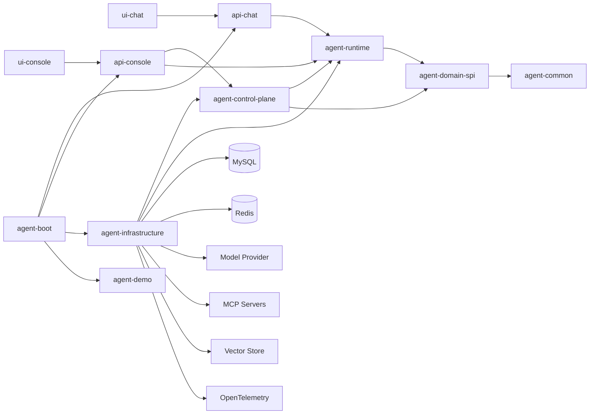
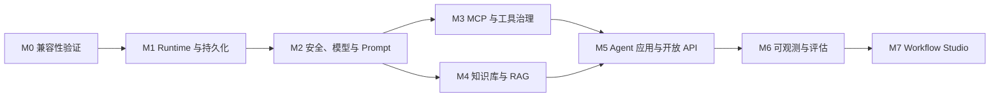

# Agent Template Pro 完整能力实施计划

> 版本：v1.0
>
> 日期：2026-08-01
>
> 输入依据：[Spring AI Alibaba Admin 调研与能力差距](./Spring-AI-Alibaba-Admin调研与能力差距.md)、[智能体开发脚手架系统设计书](../智能体开发脚手架系统设计书.md)
> 计划性质：实施基线，不代表文档中的能力已经完成

> 范围变更说明：本计划代替旧设计书中“暂不建设可视化 Workflow、MCP 管理和知识库管理”的范围限制。当前源码仍以确定性 Demo 和 `InMemoryRuntimeStore` 为事实基线；本文所列能力均是后续实施目标，不得描述为已实现功能。

## 1. 目标与范围

本计划把 `agent-template-pro` 从当前确定性 Demo 脚手架推进为代码优先的 Agent 开发、运行和治理平台。最终范围包含：

1. 真实 Spring AI Alibaba Agent/Graph Runtime。
2. 会话、任务、确认、事件、审计和 Graph 状态的持久化与恢复。
3. 模型供应商、模型实例、Prompt 和发布管理。
4. MCP Server、MCP Tool 和统一工具目录管理。
5. 知识库、文档、切片、索引和检索管理。
6. Agent 应用、版本、资源绑定、发布和回滚。
7. Trace、指标、日志关联和运行诊断。
8. 数据集、评估器、实验和回归评估。
9. 管理员认证、RBAC、API Key、密钥引用和操作审计。
10. 可视化 Workflow、调试、暂停恢复和版本发布。

所有能力都进入目标范围，但不会一次性塞进同一个版本。MCP 和知识库属于核心控制面，在生产 Runtime 完成后优先交付；Workflow Studio 排在最后，因为它依赖前面所有资源和运行协议。

## 2. 必须保持的边界

- 模型只负责意图理解、参数提取、内容生成和解释，不负责授权、确认、幂等和最终业务状态判断。
- `COMMIT`、`PAYMENT`、`AFTER_SALE` 动作必须通过任务与二次确认，MCP Tool 和 Workflow 节点不能绕过该门禁。
- MySQL 保存业务事实；Redis 只保存缓存、锁、短期状态和 Graph checkpoint。
- Prompt、模型、MCP、知识库和 Workflow 的生产发布必须版本化、可审计、可回滚。
- 密钥只保存外部 Secret/KMS 引用，不能进入前端包、普通数据库字段、日志或 Trace。
- Chat 和 Console 保持独立身份、Cookie、CORS 和 API 前缀。
- 不直接复制 Spring AI Alibaba Admin 的鉴权、CORS、Token URL 传递或 classpath 私钥实现。
- 保留代码优先模式。可视化 Workflow 是受控扩展，不允许后台创建任意 URL 写操作或修改权限规则。

## 3. 目标架构

为避免把管理用例塞进 Runtime 或 Infrastructure，新增 `agent-control-plane` 模块。它拥有模型、Prompt、MCP、知识库、应用、评估和观测的管理用例与端口；Infrastructure 负责具体技术实现。



### 3.1 模块职责调整

| 模块 | 新增职责 | 禁止事项 |
| --- | --- | --- |
| `agent-common` | 通用分页、错误、脱敏、SecretRef、稳定值对象 | 不放 Web、数据库和管理业务 |
| `agent-domain-spi` | 动作 Schema、工具风险等级、知识/MCP 引用契约 | 不依赖具体 SDK、数据库或模型厂商 |
| `agent-runtime` | SAA Graph、Agent 理解、任务门禁、事件编排、恢复协议 | 不写管理 CRUD 和具体业务规则 |
| `agent-control-plane` | 模型、Prompt、MCP、知识库、应用、评估、观测管理用例和端口 | 不直接实现数据库、MCP SDK 或向量库 |
| `agent-infrastructure` | JDBC/Redis、模型、MCP Client、对象存储、向量库、OTel、Nacos 实现 | 不决定业务动作权限和状态 |
| `api-chat` | 访客 API、SSE、归属校验 | 不暴露控制台管理能力 |
| `api-console` | 管理 API、认证、RBAC、DTO 转换 | 不代理执行裸业务动作 |
| `agent-boot` | Profile、Bean 装配、迁移、健康检查 | 不承载领域或控制面业务逻辑 |

## 4. 统一资源模型

所有可管理资源必须具备：

- 稳定 ID、资源 code、显示名称、状态、版本和乐观锁版本号。
- `createdBy`、`updatedBy`、`createdAt`、`updatedAt`。
- `DRAFT`、`PUBLISHED`、`DISABLED`、`ARCHIVED` 等受控状态。
- Resource scope。当前默认单项目，不扩展为多租户计费系统。
- 发布快照。运行时只读取已发布版本，草稿不会直接影响在线会话。
- 引用关系。删除模型、Prompt、MCP Tool、知识库前必须检查 Agent/Workflow 引用。
- 审计事件。新增、修改、测试、发布、回滚、启停和删除均追加记录。

## 5. 数据库迁移规划

迁移只能新增，下面的版本号以当前 `V001` 为基线；落地时如已有并行迁移，应重新顺延编号。

| 迁移 | 主要表 | 目的 |
| --- | --- | --- |
| `V002__runtime_recovery.sql` | `agent_pending_action`、`agent_stream_event`、`agent_tool_execution`、`agent_task_outbox` | 补齐恢复、事件游标、工具执行和可靠事件投递 |
| `V003__console_security.sql` | `agent_admin_user`、`agent_admin_role`、`agent_admin_permission`、关联表、`agent_admin_session` | 管理员认证、共享会话和 RBAC |
| `V004__model_and_prompt.sql` | `agent_model_provider`、`agent_model_config`、`agent_prompt`、`agent_prompt_version`、`agent_prompt_publication` | 模型与 Prompt 版本化 |
| `V005__mcp_management.sql` | `agent_mcp_server`、`agent_mcp_sync_job`、`agent_mcp_tool`、`agent_mcp_tool_version` | MCP 配置、能力快照和同步状态 |
| `V006__knowledge_base.sql` | `agent_knowledge_base`、`agent_knowledge_document`、`agent_knowledge_document_version`、`agent_knowledge_chunk`、`agent_knowledge_index_job` | 知识库元数据、切片和异步索引 |
| `V007__agent_application.sql` | `agent_application`、`agent_application_version`、`agent_application_binding`、`agent_api_key` | Agent 应用、资源绑定、发布和开放 API |
| `V008__evaluation.sql` | `agent_eval_dataset`、`agent_eval_dataset_version`、`agent_eval_case`、`agent_evaluator`、`agent_evaluator_version`、`agent_experiment`、`agent_experiment_result` | 评估闭环 |
| `V009__workflow.sql` | `agent_workflow`、`agent_workflow_version`、`agent_workflow_run`、`agent_workflow_node_run` | Workflow 定义、版本和运行轨迹 |

关键唯一约束：

- `agent_task(action_code, idempotency_key)` 保持唯一。
- Prompt、MCP Server、知识库、Agent 和 Workflow 的 code 在项目范围内唯一。
- MCP Tool 版本以 `(mcp_server_id, tool_name, schema_digest)` 唯一。
- 文档版本和索引任务有唯一业务键，重复回调或重复消费不得生成第二份有效索引。
- 发布操作使用状态条件更新，不能只依赖应用内检查。

## 6. API 总体约定

- Chat API 继续使用 `/api/chat/v1`。
- Console API 继续使用 `/api/console/v1`。
- 所有列表接口统一 `page`、`size`、`keyword`、`status` 和稳定排序。
- 发布、回滚、同步、测试、重建索引等命令使用 `POST /{id}:command`。
- 所有写请求携带 request ID；高风险管理命令写入审计记录。
- Console 只返回 `secretConfigured`、`secretRefType` 等非敏感状态，不返回密钥值。
- 错误响应统一包含 `code`、`message`、`requestId`、`retryable`。

## 7. 分阶段实施

### M0：架构冻结与兼容性验证

目标：先证明技术基线可用，避免在错误依赖坐标上建设控制面。

后端任务：

1. 增加 Spring AI Alibaba BOM/Extensions BOM，并验证与 Spring Boot 3.5.14、Spring AI 1.1.2、JDK 21 的依赖收敛。
2. 建立 DashScope 和 OpenAI-compatible 两个独立 Maven Profile，只允许一次启用一个默认 ChatModel。
3. 用最小 `ReactAgent`、Graph、Tool 和结构化输出样例跑通非流式与流式调用。
4. 验证 Graph `RunnableConfig`、thread ID、checkpoint saver 和 Reactor/WebFlux 适配方式。
5. 输出 ADR：SAA 版本、MCP SDK、向量库、对象存储、OTel 后端、Nacos 是否启用。

验收门槛：

- Maven 依赖树无冲突和未知旧 starter。
- 两个模型 Profile 分别能启动，未配置密钥时给出稳定健康状态而不是启动崩溃。
- 最小 Tool 调用不会绕过 `ActionMode`。
- 形成可执行的兼容性测试，不只记录手工结论。

### M1：生产级 Runtime 与持久化

目标：替换关键词 Demo 路由和内存事实源，建立后续模块的共同基础。

后端任务：

1. 拆分 `ChatOrchestrator` 为理解、参数收集、策略门禁、任务执行、事件发布和恢复服务。
2. 以 SAA 结构化输出生成 `IntentDecision`，只允许选择已注册 `ActionDescriptor`。
3. 实现 JDBC `RuntimeStore`，覆盖会话、消息、PendingAction、Task、Confirmation、Event、ToolExecution 和 Audit。
4. 实现合法状态转换、乐观锁、确认快照 hash、过期检查和并发确认保护。
5. 实现结果未知、主动查单、回调推进、人工处理和可重试失败的标准协议。
6. 引入 Outbox，确保状态变更和异步事件不会因进程退出而丢失。
7. Redis 实现 Graph checkpoint、分布式锁和短期缓存，MySQL 保存可追责事实。

前端任务：

- `ui-chat` 增加断流重连、sequence 补拉、任务恢复、失败重试和结果未知状态。
- `ui-console` 增加任务详情、事件时间线、工具执行记录和审计详情。

验收门槛：

- 进程在等待补参、等待确认、执行中和等待外部结果时重启，均能恢复。
- 访客 A 不能访问或确认访客 B 的资源。
- 相同幂等键并发提交只产生一次业务执行。
- 写操作超时不会直接重复执行。
- Runtime 单元、MySQL/Redis 集成和 Chat E2E 测试通过。

### M2：管理安全、模型与 Prompt

目标：建立控制面的身份和最先使用的工程能力。

管理安全：

1. 管理员、角色、权限、共享 Session 和登出失效。
2. CORS 白名单、CSRF/Token 策略、登录限流、审计和敏感字段白名单。
3. SecretRef 支持环境变量、Kubernetes Secret 和外部 KMS 标识，不保存真实值。

模型管理：

1. Provider/Model CRUD、类型、参数规则、启停和默认模型选择。
2. Chat、Embedding、Rerank 分类型管理。
3. 连通性测试、健康状态、超时、限流、调用配额和非敏感配置展示。

Prompt 管理：

1. Prompt、版本、变量 Schema、草稿、对比、审核、发布和回滚。
2. 在线调试使用隔离的测试会话，记录模型、参数、token、耗时和 trace ID。
3. 运行时只读取已发布快照，并在会话/任务中记录实际 Prompt 版本。
4. Nacos 作为可选发布 Adapter；数据库发布与 Nacos 下发状态分别记录，失败可重试。

主要 API：

- `/models/providers`、`/models`、`/models/{id}:test`、`/models/{id}:enable`
- `/prompts`、`/prompts/{id}/versions`、`/prompt-versions/{id}:debug`
- `/prompt-versions/{id}:publish`、`/prompt-publications/{id}:retry`、`/prompts/{id}:rollback`

验收门槛：

- 无权限用户不能查看、测试或发布模型和 Prompt。
- API 和日志无法取回真实密钥。
- 旧 Prompt 确认不能在发布新版本后改变既有任务快照。
- 发布、失败、重试和回滚均可从审计记录还原。

### M3：MCP 管理与统一工具治理

目标：提供完整 MCP 生命周期，同时把外部 Tool 纳入现有安全门禁。

后端任务：

1. MCP Server CRUD，支持 stdio、SSE 和 Streamable HTTP；生产环境可按部署策略关闭 stdio。
2. Server 配置使用 endpoint 白名单、SecretRef、超时、代理和 TLS 策略。
3. 连接测试、健康检查、能力发现和手工/定时同步。
4. 保存 Tool Schema 快照、digest、版本差异和下线状态，不让远端变化静默影响已发布 Agent。
5. 建立统一 `ToolCatalog`，合并 `AgentAction`、MCP Tool 和受控 OpenAPI Tool。
6. 为 Tool 声明风险等级、允许场景、输入输出 Schema、超时、重试和幂等能力。
7. 在线 Debug 使用隔离身份和测试参数；默认禁止执行写类型 Tool。
8. MCP 调用生成 `agent_tool_execution`，记录摘要、耗时、状态、trace、task 和外部引用。
9. Agent/Workflow 只能绑定已审核 Tool 版本；高风险 Tool 通过 ActionFacade 创建任务并等待确认。

主要 API：

- `/mcp-servers`、`/mcp-servers/{id}:test`、`/mcp-servers/{id}:sync`
- `/mcp-servers/{id}/tools`、`/mcp-tools/{id}/versions`
- `/mcp-tools/{id}:enable`、`/mcp-tools/{id}:disable`、`/mcp-tools/{id}:debug`
- `/tools`、`/tools/{id}/references`、`/tool-executions`

前端页面：

- MCP Server 列表、创建/编辑、健康与同步历史。
- Tool 目录、Schema 版本对比、启停、引用关系和 Debug 抽屉。
- Tool 执行记录与 Trace 跳转。

验收门槛：

- MCP Server 不可把任意内网 URL 当作运行时输入，SSRF 测试通过。
- 远端 Schema 变化只生成新版本，不自动替换已发布绑定。
- 禁用或删除被引用 Tool 时返回冲突并显示引用方。
- 写 Tool 未经确认无法执行；重复调用遵守幂等策略。

### M4：知识库与 RAG 管理

目标：形成从文档到可引用答案的完整、可诊断知识闭环。

后端任务：

1. Knowledge Base CRUD，绑定 Embedding、Rerank、切片和检索配置。
2. 文档上传、元数据、版本、解析状态、批量操作和逻辑删除。
3. 对象存储通过 `ObjectStoragePort` 接入；本地开发可用文件系统，生产使用 S3/OSS 兼容实现。
4. 支持 TXT、Markdown、PDF、Word 等白名单格式，并限制文件大小、页数和解析时间。
5. 切片预览、编辑、启停、批量更新和版本化。
6. 数据库持久化 Index Job，通过 Outbox/worker 执行解析、切片、Embedding、写向量库和状态回写。
7. `VectorStorePort` 隔离具体产品；首个生产实现按 M0 ADR 选择，推荐 Elasticsearch Profile，不作为核心 Chat 的强制启动依赖。
8. 检索测试返回 query、topK、threshold、原始得分、rerank 得分、文档和切片引用。
9. 回答卡片必须包含可追溯 citation，前端不能伪造来源。
10. 删除/重建实现数据库、对象存储和向量索引之间的补偿任务。

主要 API：

- `/knowledge-bases`、`/knowledge-bases/{id}:retrieve-test`
- `/knowledge-bases/{id}/documents`、`/documents/{id}:reindex`
- `/documents/{id}/chunks:preview`、`/documents/{id}/chunks`
- `/knowledge-index-jobs`、`/knowledge-index-jobs/{id}:retry`

前端页面：

- 知识库列表、创建向导、配置、引用关系和检索测试。
- 文档列表、上传队列、解析/索引状态和失败详情。
- 切片预览/编辑、批量启停和引用定位。

验收门槛：

- 上传、解析、索引任一步骤失败都能定位并安全重试。
- 文档新版本不会静默改变已发布 Agent，必须重新发布绑定版本。
- 删除后对象、切片和向量索引最终一致，补偿任务可观察。
- 检索结果包含真实来源，越权资源不能被召回。

### M5：Agent 应用、版本与开放 API

目标：把模型、Prompt、Tool、MCP 和知识库组装成可发布的 Agent 应用。

后端任务：

1. Agent Application CRUD、草稿版本、配置校验、发布、回滚、复制和归档。
2. 版本快照固定模型、Prompt、知识库、Tool/MCP 和策略版本。
3. 发布前检查资源状态、引用完整性、权限、风险策略和评估门槛。
4. API Key 使用 hash 存储、范围权限、过期时间、轮换和撤销。
5. 提供 Agent Chat OpenAPI，但仍调用 Runtime，不建立绕过任务门禁的第二执行链。

主要 API：

- `/agents`、`/agents/{id}/versions`、`/agent-versions/{id}:validate`
- `/agent-versions/{id}:publish`、`/agents/{id}:rollback`
- `/api-keys`、`/api-keys/{id}:rotate`、`/api-keys/{id}:revoke`
- `/api/agent/v1/apps/{appCode}/chat/completions`

验收门槛：

- 发布版本不可变，回滚生成新的发布记录。
- 已撤销 API Key 立即失效，响应和日志不回显原值。
- Console Debug 与开放 API 使用同一 Runtime、同一 Tool 门禁和同一审计链。

### M6：可观测性与评估中心

目标：让 Agent 变更可度量、可比较、可回归。

可观测性任务：

1. 使用 OpenTelemetry 贯穿 request、conversation、task、action、tool、model、retrieval 和 workflow run。
2. 采集模型/Tool 延迟、token、错误、超时、结果未知、确认率和任务状态分布。
3. Prompt 和消息内容默认不进入 Trace；仅在受控调试环境按白名单采集并脱敏。
4. 通过 `TraceQueryPort` 查询外部 Trace 后端，避免把特定 ES 索引写死在控制面。

评估任务：

1. Dataset、版本和 Case；支持手工创建、批量导入和从脱敏 Trace 生成候选样本。
2. Evaluator 插件支持确定性规则、结构校验、业务断言和受控 LLM Judge。
3. Experiment 采用数据库任务和可恢复 worker，支持启动、停止、重试、结果比较和成本统计。
4. 首批固定评估：意图路由、参数提取、追问、拒绝越权、确认门禁、知识引用正确性和 Tool 选择。
5. CI 支持执行小型 golden dataset，并按阈值阻断退化版本。

主要 API：

- `/observability/traces`、`/observability/traces/{traceId}`、`/observability/overview`
- `/evaluation/datasets`、`/evaluation/evaluators`、`/evaluation/experiments`
- `/evaluation/experiments/{id}:start`、`:stop`、`:retry`、`/results`

验收门槛：

- 从任务详情可跳转到完整 Trace，反向可定位会话、Prompt 和资源版本。
- 实验服务重启后继续执行或明确进入可恢复状态。
- 同一数据集版本和 Agent 版本可重复得到可解释结果。
- 敏感内容不出现在 Trace、评估导出和错误响应中。

### M7：可视化 Workflow Studio

目标：在所有底层资源稳定后，提供受控流程编排，而不是新增第二套不受控 Runtime。

首批节点：

- Start、End、Input、Output。
- LLM、Parameter Extractor、Classifier、Judge。
- AgentAction、MCP Tool、Knowledge Retrieval、HTTP Adapter。
- Variable Assign、Parallel、Iterator、Human Input。

实现任务：

1. Workflow DSL、Schema 版本、静态校验、引用锁定和发布快照。
2. 节点执行统一委托 Runtime/Control Plane，不在节点中直接访问数据库或远端 URL。
3. 整图 Debug、单节点/局部图测试、SSE 节点进度、暂停、恢复、停止和重试。
4. 高风险节点生成任务并等待确认；Human Input 使用现有 `form.request` 或新增兼容事件。
5. Workflow 发布前执行图连通性、循环边界、资源引用、权限和评估检查。
6. 提供版本差异和回滚；DSL 导入导出最后开放，导入内容必须经过完整校验。

验收门槛：

- 非法图、无终点图、未绑定资源和越权 Tool 无法发布。
- 暂停和重启后可以恢复到确定节点，不重复已成功的写动作。
- Workflow 不能绕过 ActionMode、visitor ownership、确认版本和幂等键。
- 桌面和移动视口无节点遮挡、工具栏溢出或关键操作不可达。

## 8. Console 信息架构

```text
运行中心
├── 总览
├── 会话
├── 任务与事件
├── Tool 执行
└── Trace

Agent 开发
├── Agent 应用
├── Prompt
├── Workflow
├── 数据集
├── 评估器
└── 实验

资源中心
├── 模型服务
├── MCP
├── 工具目录
└── 知识库

系统管理
├── 管理员与角色
├── API Key
├── Secret 引用
├── 运行配置
└── 审计日志
```

页面应采用信息密集的运营工具布局。列表使用服务端分页和筛选，详情使用独立页面或抽屉；测试、发布、回滚、同步和删除必须有明确状态，不用静态假数据填充指标。

## 9. 测试策略

| 范围 | 必测内容 |
| --- | --- |
| Runtime | 结构化路由、补参、确认、幂等、状态机、断流、恢复、结果未知 |
| 身份安全 | 访客隔离、管理员权限、API Key 范围、CORS、SSRF、Secret 不泄漏 |
| Persistence | 唯一约束、乐观锁、Outbox、并发状态更新、迁移、重启恢复 |
| MCP | 三种 transport、连接失败、Schema 漂移、Tool 禁用、超时和高风险门禁 |
| Knowledge | 文件校验、解析、切片、索引、补偿、检索权限、citation |
| Prompt/Model | 版本发布、回滚、下发失败、连通性、模型降级和参数校验 |
| Evaluation | 可重复实验、停止恢复、阈值、成本统计、敏感信息脱敏 |
| Workflow | 图校验、并行/循环、暂停恢复、局部测试和写动作只执行一次 |
| Frontend | 类型检查、构建、空态、加载、失败、权限、桌面/移动溢出和 E2E |

每个里程碑至少执行：

```bash
mvn test
npm --prefix ui-chat run build
npm --prefix ui-console run build
git diff --check
```

涉及 MySQL、Redis、MCP 或向量库时增加 Testcontainers/集成环境测试；涉及 UI 时增加 Playwright 桌面与移动视口验证。

## 10. 发布与兼容策略

- 数据库只前向迁移；发布失败通过应用回滚，不回滚已执行迁移。
- Chat 事件协议保持向后兼容；新增事件需先让前端忽略未知类型。
- Tool、Prompt、知识库和 Workflow 发布版本不可变，运行记录保存实际版本 ID。
- 功能通过 Profile/feature flag 分阶段开启：`model-*`、`mcp`、`knowledge-*`、`observability-*`。
- 默认本地 Demo 不要求启动全部中间件；生产 Profile 必须执行安全配置检查。
- 每个里程碑都提供迁移、部署、健康检查、回滚和数据一致性检查命令。

## 11. 建议交付顺序



M3 和 M4 可以在 M2 完成后并行建设，但二者都必须复用同一个资源版本、发布、SecretRef、审计和异步任务框架。

## 12. 每个里程碑的完成标准

一个里程碑只有同时满足以下条件才算完成：

1. 后端、前端、数据库迁移和文档同时交付，不留只有页面没有 API 的占位功能。
2. Controller 只处理协议和鉴权，业务用例在 Runtime/Control Plane，技术实现在 Infrastructure。
3. 资源归属、RBAC、确认门禁、幂等和审计没有旁路。
4. 失败、重试、取消、超时、结果未知和恢复状态均可操作、可查询。
5. 新增响应、日志、Trace、审计和导出不泄露密钥或敏感内容。
6. 测试与构建通过，关键链路具备自动化回归。
7. `git diff` 不包含生成目录、个人配置、真实凭据或无关改动。

## 13. 第一批可直接执行的任务包

实施不从大而全的 Console 页面开始，第一批按以下顺序拆票：

1. `M0-01`：Spring AI Alibaba 依赖/BOM/Profile 兼容性测试。
2. `M0-02`：最小 ReactAgent + Graph + AgentAction 受控 Tool 纵向样例。
3. `M1-01`：RuntimeStore JDBC 领域模型和 `V002` 迁移。
4. `M1-02`：任务状态条件更新、确认并发和幂等集成测试。
5. `M1-03`：SAA 结构化意图与参数提取替换 Demo `select/extract`。
6. `M1-04`：Outbox、事件补拉和重启恢复。
7. `M2-01`：`agent-control-plane` 模块、RBAC 和 SecretRef 基础。
8. `M2-02`：模型管理纵向切片，包括 API、表、Provider Adapter、Console 页面和测试。
9. `M2-03`：Prompt 版本、Debug、发布和回滚纵向切片。
10. `M3-01`：MCP Server 连接测试与 Tool discovery 纵向切片。
11. `M3-02`：MCP Tool 版本快照、绑定和高风险门禁。
12. `M4-01`：知识库、文档上传和 Index Job 纵向切片。
13. `M4-02`：切片管理、向量检索测试和 citation 闭环。

第一批完成后，项目应具备真实模型、可恢复 Runtime、受控 MCP 和可用知识库四条端到端主链，再进入 Agent 应用、评估和 Workflow 建设。
