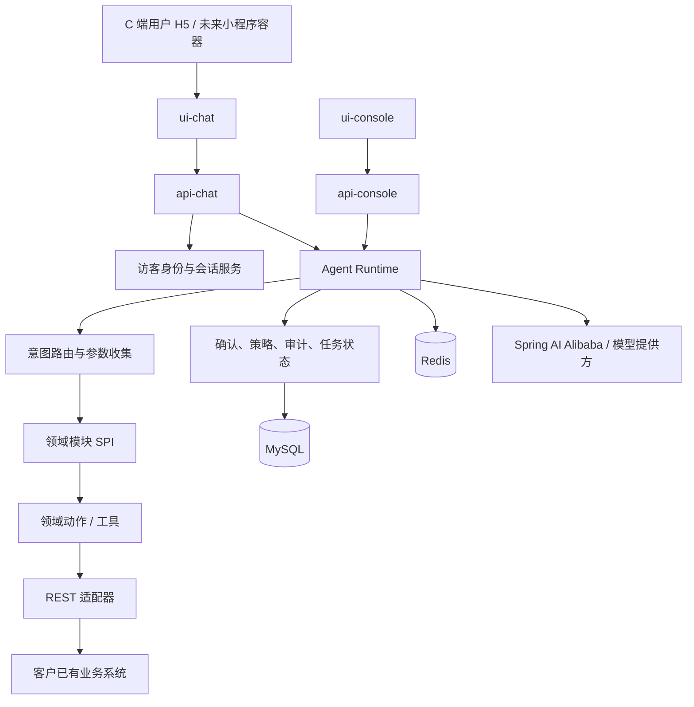
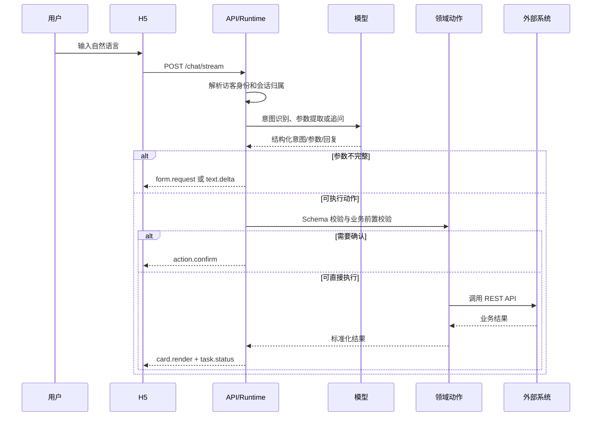

# Agent 开发脚手架系统设计书

> 项目代号：`agent-template-pro`  
> 文档版本：v0.1  
> 设计状态：基线设计，待实现  
> 适用方式：单客户、单项目、整仓 clone 后代码二次开发

## 1. 定位与边界

### 1.1 一句话定位

`agent-template-pro` 是一个基于 Spring AI Alibaba 的、面向 C 端业务应用的代码优先 Agent 开发脚手架。开发团队 clone 整个仓库、接入已有 REST API、编写领域模块，即可交付支持自然语言交互的 H5 Agent 应用。

它不是低代码 Agent 平台，不以在后台拖拽配置来替代业务开发；它也不是多租户 SaaS。每个客户或业务项目拥有一套独立代码、独立部署、独立数据库与独立密钥。

### 1.2 首个验证场景

首个未来项目是“客运购票 Agent”：用户通过 H5 用自然语言查询班次、选择班次、填写乘车人、创建订单、发起真实支付、查询订单、改签或退票。

客运接口、支付接口、锁座时长、出票状态、改签和退票规则都属于客运业务模块，不进入脚手架核心。该项目只用于证明脚手架能够承载真实的查询、确认、异步结果与交易型流程。

### 1.3 目标

- 用统一工程结构承载多个未来 C 端 Agent 项目。
- 将已有 REST API 安全地包装为可被 Agent 使用的领域动作。
- 支持自然语言理解、缺失参数追问、流式回复、结构化卡片和用户确认。
- 支持匿名访问下的稳定访客识别、会话隔离和聊天记录查询。
- 为查询、下单、支付、异步处理等不同复杂度的业务动作提供统一的运行机制。
- 让新的业务项目主要新增领域模块、API 适配器、业务 UI 组件和 Prompt，而不是复制修改核心运行代码。

### 1.4 非目标

- 不做多租户、租户计费、租户级模型隔离。
- 不做可视化工作流编排器或让业务人员通过后台创建 Agent。
- 不把酒店、客运、物流、支付等任何一个业务领域固化在核心包中。
- 不在 v0.1 引入 Elasticsearch、Nacos、复杂 BI 大盘或微服务拆分。
- 不让大模型决定用户权限、资金操作结果、库存结果或最终业务状态。
- 不承诺“任意 REST API 零代码接入”；安全、字段映射和业务规则必须由开发者编码。

## 2. 核心设计原则

1. **代码优先，整仓二开。** Agent、领域动作、外部系统适配器、页面组件和 Prompt 都是版本化代码；每个项目独立维护。
2. **模型负责理解，代码负责执行。** 大模型只能识别意图、提取参数、生成追问和解释结果。参数校验、鉴权、确认、调用、幂等、状态判断全部由确定性代码完成。
3. **领域规则不下沉到核心。** 核心只定义“动作、确认、任务、事件、会话”的通用机制；领域模块定义“购票、退款、预约、申报”等实际规则。
4. **先可恢复，再追求多 Agent。** 用户关闭页面、网络断开、外部接口超时后，应能依据会话和任务记录恢复真实状态。复杂跨领域协作后置。
5. **单租户部署，但身份不能缺失。** 匿名访问不等于无身份。每个访问者必须有不可伪造的访客身份，用于隔离会话、任务和业务上下文。
6. **外部系统是业务事实源。** 本系统只保存交互过程、调用记录和必要的业务引用；订单、支付、库存等最终状态以外部业务系统的查询结果或可靠回调为准。
7. **安全默认收紧。** 不把消息放在 GET URL，不信任前端传入的 `threadId`，不在日志中记录敏感字段和密钥。

## 3. 总体架构



系统由四层组成：

| 层次 | 职责 | 禁止承担的职责 |
| --- | --- | --- |
| 交互层 | H5 Chat、卡片、表单、确认、支付跳转、会话列表 | 不调用外部业务 API；不决定权限或订单状态 |
| Agent Runtime | 路由、上下文、参数收集、模型调用、事件编排、动作调度 | 不写任何领域字段或规则 |
| 领域模块 | 定义领域 Agent、动作、输入输出、校验、Prompt、专属 UI | 不修改核心会话和鉴权基础设施 |
| 基础设施 | 数据库、缓存、模型、REST 客户端、日志、审计、配置 | 不理解某个具体业务的语义 |

## 4. 工程结构

仓库采用单仓库、模块化单体。后端初期编译为一个 Spring Boot 应用，但 `api-chat` 与 `api-console` 作为两个独立 Maven 模块维护；它们的路由、鉴权和 DTO 不互相引用。`ui-chat` 与 `ui-console` 同样独立构建和部署。

```text
agent-template-pro/
├── pom.xml
├── agent-common/                 # 纯公共类型、异常、结果、序列化；不得依赖 Web
├── agent-domain-spi/             # 领域模块、动作、卡片、策略等扩展契约
├── agent-runtime/                # Agent 编排、路由、任务状态机、事件流
├── agent-infrastructure/         # MySQL、Redis、模型、HTTP、审计等实现
├── api-chat/                     # C 端 Chat API、流式输出、访客身份与动作确认
├── api-console/                  # Console API、管理员认证、审计和运行配置查询
├── agent-boot/                   # 启动类、装配、环境配置、数据库迁移
├── agent-demo/                   # 不含真实密钥的示例领域模块
├── ui-chat/                      # Vue 3 C 端聊天 H5
├── ui-console/                   # Vue 3 轻量运营控制台
├── docs/                         # 架构、扩展、部署、接口文档
└── .env.example                  # 不含真实值的配置模板
```

### 4.1 Maven 依赖方向

```text
api-chat ─────┐
api-console ──┼──> agent-runtime ───> agent-domain-spi ───> agent-common
agent-demo ───┤
              └──> agent-infrastructure ────────────────> agent-common
agent-boot ───> api-chat + api-console + agent-demo + agent-infrastructure
```

- `agent-domain-spi` 只能定义接口和 DTO，不能依赖 MyBatis、Redis、Web 或具体模型。
- `agent-runtime` 依赖 SPI，不依赖任何具体领域模块。
- 领域模块只通过 SPI 注册能力；不得让核心按 `if (业务类型 == 客运)` 分支。
- `agent-common` 不引入 `spring-boot-starter-web`，避免所有模块被迫携带 Web 依赖。
- `api-chat` 只暴露 C 端需要的会话、消息流、表单提交、确认和任务查询接口，不能暴露后台审计与配置接口。
- `api-console` 只暴露管理员所需的登录、审计、运行健康和配置查询接口，不能代理用户聊天与业务动作。
- 两个 API 模块可以在 v0.1 被 `agent-boot` 装配为一个进程；将来需要独立扩容时，只需新增各自的 Boot 启动模块，不改变 Runtime 和领域模块。
- 实体、Mapper、Repository 按所属模块放置，不再额外建设一个全局 `dao` 模块，避免数据访问层反向成为业务中心。

### 4.2 后端模块职责与包结构

#### `agent-common`

只放与业务无关且没有 Spring Web 依赖的基础代码：错误码、基础异常、时间与 JSON 工具、分页对象、数据脱敏工具、请求上下文中的不可变值对象。禁止在这里放“万能工具类”、Controller、Mapper 或领域 DTO。

```text
agent-common/src/main/java/<base-package>/common/
├── error/                 # ErrorCode、BusinessException、ExceptionTranslator
├── json/                  # JSON 序列化约定
├── mask/                  # 手机号、证件号等脱敏策略
├── model/                 # PageQuery、PageResult 等纯值对象
└── util/                  # 小而确定的无状态工具
```

#### `agent-domain-spi`

只定义领域模块的扩展点和通用协议。它是 Runtime 与任意业务模块之间唯一的编译期边界。

```text
agent-domain-spi/src/main/java/<base-package>/spi/
├── domain/                # DomainModule、DomainDescriptor、DomainRegistry
├── action/                # AgentAction、ActionDescriptor、ActionMode
├── context/               # ActionContext、Principal、ConversationContext
├── result/                # ActionResult、CardPayload、FormPayload
├── task/                  # TaskStatus、ExternalStatusResolver
└── ui/                    # UiRenderer、UiComponentSpec
```

#### `agent-runtime`

负责运行时编排，而不是“业务服务层”。它把身份、会话、模型、领域模块、待补全参数、确认、任务和事件串成一条可恢复链路。

```text
agent-runtime/src/main/java/<base-package>/runtime/
├── chat/                  # ChatOrchestrator、MessageAssembler
├── routing/               # IntentRouter、DomainRouter、ActionSelector
├── graph/                 # Spring AI Alibaba Graph 定义与节点实现
├── pending/               # PendingAction、参数收集与字段合并
├── task/                  # TaskService、TaskStateMachine、恢复策略
├── policy/                # ConfirmationPolicy、ActionPolicyEnforcer
├── event/                 # StreamEvent、EventPublisher、事件序列号
└── prompt/                # PromptTemplate、PromptVersionResolver
```

#### `agent-infrastructure`

实现 Runtime 所需的外部能力，不包含领域业务语义。

```text
agent-infrastructure/src/main/java/<base-package>/infrastructure/
├── persistence/           # 核心表 Entity、Mapper、Repository 实现
├── redis/                 # Redis、Redisson、限流与分布式锁
├── llm/                   # ChatModel 装配、模型健康检查、模型选择
├── http/                  # WebClient、签名扩展、超时与重试基座
├── identity/              # Visitor Cookie 编解码与 IdentityResolver
├── audit/                 # 审计事件落库与结构化日志
└── config/                # @ConfigurationProperties 与自动装配
```

#### `api-chat` 与 `api-console`

两个模块只承担入站适配。每个模块各自维护 Controller、请求/响应 DTO、过滤器、鉴权和异常到 HTTP 的映射。禁止让 Console Controller 直接访问 Chat 的 DTO、Mapper 或 Session；它们只能共同依赖 Runtime 暴露的应用服务。

```text
api-chat/src/main/java/<base-package>/chatapi/
├── controller/            # 会话、消息流、表单、确认、任务查询
├── dto/                   # ChatRequest、ConfirmRequest、StreamEventResponse
├── security/              # VisitorIdentityWebFilter、CORS、限流
└── support/               # SSE/NDJSON 写出、异常映射

api-console/src/main/java/<base-package>/consoleapi/
├── controller/            # 登录、审计、任务、运行配置、健康摘要
├── dto/                   # Console 的分页与筛选请求/响应
├── security/              # 管理员认证、角色校验、Console CORS
└── support/               # 统一响应与异常映射
```

#### `agent-demo` 与 `agent-boot`

`agent-demo` 只提供可公开发布的假数据领域模块，用于展示 API 适配、卡片、确认和异步任务协议，不包含任何客户接口、真实支付配置或受保护业务规则。`agent-boot` 是唯一默认启动模块，负责导入两个 API、Runtime、基础设施和选定的 Demo/业务模块。

## 5. 技术基线

| 项目 | 基线选择 | 说明 |
| --- | --- | --- |
| JDK | Java 21 | 统一运行时，适合 I/O 密集的流式交互；如部署环境受限可降至 Java 17 |
| 后端 | Spring Boot 3.5.x | 使用当前兼容的 Spring AI BOM 统一版本 |
| Agent 框架 | Spring AI Alibaba 1.1.2.x | 使用 `spring-ai-alibaba-graph-core`、`spring-ai-alibaba-agent-framework` 等当前坐标，禁止沿用已不存在的旧 starter 坐标 |
| 模型接入 | Spring AI Model Starter | 通过配置选择 DashScope 或 OpenAI 兼容模型，不让领域模块绑定某家模型 |
| 数据库 | MySQL 8.0 | 保存会话、消息、任务、调用记录、审计与配置 |
| 缓存 | Redis 7 | 限流、短期会话缓存、分布式锁、任务短状态；不作为唯一业务事实源 |
| 后端持久化 | MyBatis-Plus + Flyway | 保持 Java 团队可维护性，数据库变更必须有迁移脚本 |
| Chat 前端 | `ui-chat`：Vue 3 + TypeScript + Vite | H5 优先，组件和交互协议兼容后续小程序容器 |
| Console 前端 | `ui-console`：Vue 3 + TypeScript + Element Plus | 只提供必要的运维与审计能力 |
| 身份 | 访客身份 Cookie + 管理员登录 | C 端匿名可用；管理员使用独立认证与 RBAC |
| 可观测性 | Actuator + Micrometer + 结构化审计日志 | 首版不自建 SkyWalking 查询台，预留 OpenTelemetry 导出 |

版本不得散落在子模块。父 POM 同时导入 Spring Boot、Spring AI、Spring AI Alibaba BOM，并在 CI 中执行依赖收敛检查。

### 5.1 关键 Maven 依赖与版本基线

**是的，Agent Runtime 明确使用 Spring AI Alibaba。** 本项目不用已经失效的 `spring-ai-alibaba-graph-starter`、`spring-ai-alibaba-agent-starter` 或 `spring-ai-openai-spring-boot-starter`。v0.1 的已核验坐标如下：

| 能力 | Maven 坐标 | 用途 |
| --- | --- | --- |
| Spring AI Alibaba Graph | `com.alibaba.cloud.ai:spring-ai-alibaba-graph-core` | 定义和运行可恢复的 Graph 状态机 |
| Spring AI Alibaba Agent | `com.alibaba.cloud.ai:spring-ai-alibaba-agent-framework` | `ReactAgent`、Agent Tool、Agent 扩展能力 |
| DashScope 模型 | `com.alibaba.cloud.ai:spring-ai-alibaba-starter-dashscope` | 可选模型提供方；只在选择通义时启用 |
| OpenAI 兼容模型 | `org.springframework.ai:spring-ai-starter-model-openai` | 可选模型提供方；用于 OpenAI 协议兼容服务 |
| Graph 观测 | `com.alibaba.cloud.ai:spring-ai-alibaba-starter-graph-observation` | 可选，接入 Micrometer/OTel 观测 Graph |
| Web 流式 API | `org.springframework.boot:spring-boot-starter-webflux` | Chat 的 `Flux`、SSE/NDJSON 流式响应与 WebClient |
| 参数校验 | `org.springframework.boot:spring-boot-starter-validation` | Controller 与动作输入的 Bean Validation |
| MySQL / ORM | `com.baomidou:mybatis-plus-spring-boot3-starter` | 核心会话、任务、审计等关系数据访问 |
| MySQL 驱动 | `com.mysql:mysql-connector-j` | 由 Spring Boot BOM 管理版本，禁止使用旧 `mysql-connector-java` |
| 迁移 | `org.flywaydb:flyway-core`、`org.flywaydb:flyway-mysql` | 版本化数据库迁移 |
| Redis | `org.springframework.boot:spring-boot-starter-data-redis` | 基础缓存与连接管理 |
| Redisson | `org.redisson:redisson-spring-boot-starter` | 分布式锁；Spring AI Alibaba 的 `RedisSaver` 也依赖 `RedissonClient` |
| C 端/后台鉴权 | `cn.dev33:sa-token-reactor-spring-boot3-starter` | WebFlux 场景的管理员认证；C 端访客身份仍由自定义签名 Cookie 负责 |
| 健康检查 | `org.springframework.boot:spring-boot-starter-actuator` | 运行状态、依赖连通性与指标端点 |
| 测试 | `org.springframework.boot:spring-boot-starter-test`、`io.projectreactor:reactor-test` | 单元、集成和流式事件测试 |

Spring AI Alibaba 的 BOM 只管理其自身模块；Spring AI 模型 Starter 仍需额外导入 Spring AI BOM。DashScope Starter 所属的扩展模块则由 `spring-ai-alibaba-extensions-bom` 管理。因此父 POM 必须同时导入三个 BOM。

### 5.2 父 POM 示例

以下 POM 是脚手架初始化时可直接采用的基线。`groupId` 按实际开源组织替换；版本固定用于首版集成验证，后续升级必须在单独分支完成完整回归，不在业务开发中顺带升级。

```xml
<?xml version="1.0" encoding="UTF-8"?>
<project xmlns="http://maven.apache.org/POM/4.0.0"
         xmlns:xsi="http://www.w3.org/2001/XMLSchema-instance"
         xsi:schemaLocation="http://maven.apache.org/POM/4.0.0 https://maven.apache.org/xsd/maven-4.0.0.xsd">
    <modelVersion>4.0.0</modelVersion>

    <parent>
        <groupId>org.springframework.boot</groupId>
        <artifactId>spring-boot-starter-parent</artifactId>
        <version>3.5.8</version>
        <relativePath/>
    </parent>

    <groupId>com.manzhushaka</groupId>
    <artifactId>agent-template-pro</artifactId>
    <version>0.1.0-SNAPSHOT</version>
    <packaging>pom</packaging>

    <modules>
        <module>agent-common</module>
        <module>agent-domain-spi</module>
        <module>agent-runtime</module>
        <module>agent-infrastructure</module>
        <module>api-chat</module>
        <module>api-console</module>
        <module>agent-demo</module>
        <module>agent-boot</module>
    </modules>

    <properties>
        <java.version>21</java.version>
        <spring-ai.version>1.1.2</spring-ai.version>
        <spring-ai-alibaba.version>1.1.2.3</spring-ai-alibaba.version>
        <mybatis-plus.version>3.5.17</mybatis-plus.version>
        <sa-token.version>1.45.0</sa-token.version>
        <redisson.version>4.6.1</redisson.version>
    </properties>

    <dependencyManagement>
        <dependencies>
            <dependency>
                <groupId>org.springframework.ai</groupId>
                <artifactId>spring-ai-bom</artifactId>
                <version>${spring-ai.version}</version>
                <type>pom</type>
                <scope>import</scope>
            </dependency>
            <dependency>
                <groupId>com.alibaba.cloud.ai</groupId>
                <artifactId>spring-ai-alibaba-extensions-bom</artifactId>
                <version>${spring-ai-alibaba.version}</version>
                <type>pom</type>
                <scope>import</scope>
            </dependency>
            <dependency>
                <groupId>com.alibaba.cloud.ai</groupId>
                <artifactId>spring-ai-alibaba-bom</artifactId>
                <version>${spring-ai-alibaba.version}</version>
                <type>pom</type>
                <scope>import</scope>
            </dependency>
            <dependency>
                <groupId>com.baomidou</groupId>
                <artifactId>mybatis-plus-spring-boot3-starter</artifactId>
                <version>${mybatis-plus.version}</version>
            </dependency>
            <dependency>
                <groupId>cn.dev33</groupId>
                <artifactId>sa-token-reactor-spring-boot3-starter</artifactId>
                <version>${sa-token.version}</version>
            </dependency>
            <dependency>
                <groupId>org.redisson</groupId>
                <artifactId>redisson-spring-boot-starter</artifactId>
                <version>${redisson.version}</version>
            </dependency>
        </dependencies>
    </dependencyManagement>
</project>
```

### 5.3 各 Maven 模块依赖

#### `agent-runtime/pom.xml`

Runtime 只依赖 Spring AI Alibaba 的编排与 Agent 能力，不依赖某个模型提供方、数据库或 Web。

```xml
<dependencies>
    <dependency>
        <groupId>com.manzhushaka</groupId>
        <artifactId>agent-domain-spi</artifactId>
        <version>${project.version}</version>
    </dependency>
    <dependency>
        <groupId>com.alibaba.cloud.ai</groupId>
        <artifactId>spring-ai-alibaba-graph-core</artifactId>
    </dependency>
    <dependency>
        <groupId>com.alibaba.cloud.ai</groupId>
        <artifactId>spring-ai-alibaba-agent-framework</artifactId>
    </dependency>
    <dependency>
        <groupId>org.springframework</groupId>
        <artifactId>spring-context</artifactId>
    </dependency>
</dependencies>
```

#### `agent-infrastructure/pom.xml`

基础设施实现会话、任务与审计的持久化，Redis/Redisson 协调，以及外部 HTTP 调用基座。

```xml
<dependencies>
    <dependency>
        <groupId>com.manzhushaka</groupId>
        <artifactId>agent-runtime</artifactId>
        <version>${project.version}</version>
    </dependency>
    <dependency>
        <groupId>org.springframework.boot</groupId>
        <artifactId>spring-boot-starter-jdbc</artifactId>
    </dependency>
    <dependency>
        <groupId>com.baomidou</groupId>
        <artifactId>mybatis-plus-spring-boot3-starter</artifactId>
    </dependency>
    <dependency>
        <groupId>com.mysql</groupId>
        <artifactId>mysql-connector-j</artifactId>
        <scope>runtime</scope>
    </dependency>
    <dependency>
        <groupId>org.flywaydb</groupId>
        <artifactId>flyway-core</artifactId>
    </dependency>
    <dependency>
        <groupId>org.flywaydb</groupId>
        <artifactId>flyway-mysql</artifactId>
    </dependency>
    <dependency>
        <groupId>org.springframework.boot</groupId>
        <artifactId>spring-boot-starter-data-redis</artifactId>
    </dependency>
    <dependency>
        <groupId>org.redisson</groupId>
        <artifactId>redisson-spring-boot-starter</artifactId>
    </dependency>
    <dependency>
        <groupId>org.springframework.boot</groupId>
        <artifactId>spring-boot-starter-webflux</artifactId>
    </dependency>
</dependencies>
```

#### `api-chat/pom.xml`

```xml
<dependencies>
    <dependency>
        <groupId>com.manzhushaka</groupId>
        <artifactId>agent-runtime</artifactId>
        <version>${project.version}</version>
    </dependency>
    <dependency>
        <groupId>org.springframework.boot</groupId>
        <artifactId>spring-boot-starter-webflux</artifactId>
    </dependency>
    <dependency>
        <groupId>org.springframework.boot</groupId>
        <artifactId>spring-boot-starter-validation</artifactId>
    </dependency>
</dependencies>
```

`api-chat` 不使用管理员 Token 识别匿名用户；它依赖基础设施提供的签名 Cookie `VisitorPrincipal`。如未来接入客户小程序，只替换身份解析器实现，不替换 Chat Controller。

#### `api-console/pom.xml`

```xml
<dependencies>
    <dependency>
        <groupId>com.manzhushaka</groupId>
        <artifactId>agent-runtime</artifactId>
        <version>${project.version}</version>
    </dependency>
    <dependency>
        <groupId>org.springframework.boot</groupId>
        <artifactId>spring-boot-starter-webflux</artifactId>
    </dependency>
    <dependency>
        <groupId>org.springframework.boot</groupId>
        <artifactId>spring-boot-starter-validation</artifactId>
    </dependency>
    <dependency>
        <groupId>cn.dev33</groupId>
        <artifactId>sa-token-reactor-spring-boot3-starter</artifactId>
    </dependency>
</dependencies>
```

#### `agent-boot/pom.xml`

启动模块聚合内部模块，并通过 Maven Profile 选择**一种**模型提供方。不要同时把多个模型 Starter 当作默认自动配置启用，以免产生多个 `ChatModel` 候选和不可预测的默认选择。

```xml
<dependencies>
    <dependency><groupId>com.manzhushaka</groupId><artifactId>api-chat</artifactId><version>${project.version}</version></dependency>
    <dependency><groupId>com.manzhushaka</groupId><artifactId>api-console</artifactId><version>${project.version}</version></dependency>
    <dependency><groupId>com.manzhushaka</groupId><artifactId>agent-infrastructure</artifactId><version>${project.version}</version></dependency>
    <dependency><groupId>com.manzhushaka</groupId><artifactId>agent-demo</artifactId><version>${project.version}</version></dependency>
    <dependency><groupId>org.springframework.boot</groupId><artifactId>spring-boot-starter-actuator</artifactId></dependency>
    <dependency><groupId>org.springframework.boot</groupId><artifactId>spring-boot-starter-test</artifactId><scope>test</scope></dependency>
</dependencies>

<profiles>
    <profile>
        <id>dashscope</id>
        <dependencies>
            <dependency>
                <groupId>com.alibaba.cloud.ai</groupId>
                <artifactId>spring-ai-alibaba-starter-dashscope</artifactId>
            </dependency>
        </dependencies>
    </profile>
    <profile>
        <id>openai-compatible</id>
        <dependencies>
            <dependency>
                <groupId>org.springframework.ai</groupId>
                <artifactId>spring-ai-starter-model-openai</artifactId>
            </dependency>
        </dependencies>
    </profile>
    <profile>
        <id>graph-observation</id>
        <dependencies>
            <dependency>
                <groupId>com.alibaba.cloud.ai</groupId>
                <artifactId>spring-ai-alibaba-starter-graph-observation</artifactId>
            </dependency>
        </dependencies>
    </profile>
</profiles>
```

典型启动命令：`mvn -pl agent-boot -am spring-boot:run -Pdashscope`。若使用 OpenAI 兼容服务，改用 `-Popenai-compatible`。Profile 仅选择依赖，实际 API Key、模型名、地址仍必须从环境变量或受控配置读取。

## 6. 领域模块与动作 SPI

### 6.1 设计目标

未来每个项目新增业务时，应主要完成以下工作：

1. 增加一个领域模块，例如 `travel-agent`、`hotel-agent`、`logistics-agent`。
2. 注册领域描述、Prompt、意图样例和允许的动作。
3. 为每个动作定义严格的输入 Schema、后端校验和输出映射。
4. 编写外部 REST API 适配器。
5. 按需提供 H5 卡片、表单和结果渲染组件。

### 6.2 核心接口示意

```java
public interface DomainModule {
    DomainDescriptor descriptor();
    Collection<AgentAction<?, ?>> actions();
    Collection<UiRenderer> uiRenderers();
}

public interface AgentAction<I, O> {
    ActionDescriptor descriptor();
    ValidationResult validate(ActionContext context, I input);
    ActionResult<O> execute(ActionContext context, I input);
}

public record ActionDescriptor(
        String code,
        String displayName,
        ActionMode mode,
        JsonSchema inputSchema,
        ConfirmationPolicy confirmationPolicy) {}
```

其中：

- `DomainModule` 表示一个完整业务领域，不是一个数据库表或一个接口集合。
- `AgentAction` 是 Agent 能发起的确定性业务动作，例如“查询库存”“创建草稿”“提交申请”。
- `inputSchema` 是模型输出和前端表单共同遵守的输入契约，运行时必须再次校验。
- `execute` 只接收经验证的结构化参数，不能直接吃模型生成的自然语言。
- `UiRenderer` 将领域输出映射为通用事件中的卡片、表单、确认框等 UI 描述。

### 6.3 动作模式

| 模式 | 含义 | 默认策略 |
| --- | --- | --- |
| `QUERY` | 只读查询 | 可直接执行，保留审计记录 |
| `DRAFT` | 创建草稿或计算结果，不产生最终业务影响 | 可执行，向用户展示结果 |
| `COMMIT` | 创建订单、提交申请、修改业务数据 | 必须完成字段校验并二次确认 |
| `PAYMENT` | 发起支付或资金相关动作 | 必须确认、幂等、审计；结果异步核验 |
| `AFTER_SALE` | 退款、退票、改签、撤销 | 必须由领域模块定义资格校验和确认文案 |

动作模式不是客运业务规则，而是脚手架的通用风险边界。领域模块可以增加细分策略，但不能绕过 `COMMIT`、`PAYMENT`、`AFTER_SALE` 的确认与审计要求。

### 6.4 新领域模块开发模板

未来项目新增领域时，在业务项目中创建独立模块，例如 `business-travel-agent`。该模块可以依赖脚手架 SPI 与 Runtime，但脚手架主仓库不能反向依赖它。

```text
business-travel-agent/
└── src/main/java/<business-package>/travel/
    ├── TravelDomainModule.java      # 注册领域、动作、Prompt 与 UI 渲染器
    ├── action/                      # QueryScheduleAction、CreateOrderAction 等
    ├── adapter/                     # TravelApiClient、签名、响应映射
    ├── dto/                         # 外部 API DTO 与内部动作 DTO，禁止混用
    ├── policy/                      # 客运专属资格、时效和确认策略
    ├── prompt/                      # 客运领域 Prompt、意图示例、字段说明
    ├── ui/                          # 班次卡、订单卡、乘客表单等渲染器
    └── config/                      # 业务 API 地址、密钥引用、Bean 装配
```

每一个领域动作必须至少提供：

| 项目 | 说明 |
| --- | --- |
| `code` | 稳定且唯一，例如 `travel.schedule.query`；不是展示文案 |
| 输入 DTO | Bean Validation 注解和 JSON Schema；字段来源必须可追溯 |
| 输出 DTO | 与外部 API 响应解耦，禁止直接把对方原始报文交给前端或模型 |
| 前置校验 | 登录态、资格、字段合法性、状态条件等确定性逻辑 |
| 风险等级 | 对应 `QUERY/DRAFT/COMMIT/PAYMENT/AFTER_SALE` |
| 确认快照 | 高风险动作的对象、金额、数量、规则和版本摘要 |
| 幂等策略 | 幂等键生成、外部传递方式和“结果未知”的查单规则 |
| 结果渲染 | 文本摘要、卡片、表单或任务状态的标准化输出 |
| 审计字段 | 领域代码、动作代码、外部引用、可脱敏的关键参数摘要 |

如果领域模块使用 Spring AI 的方法工具，注解应使用 Spring AI 当前包名，并且工具方法只能委托给 Runtime 的受控动作执行器：

```java
import org.springframework.ai.tool.annotation.Tool;
import org.springframework.ai.tool.annotation.ToolParam;

public class TravelQueryTool {

    private final ActionFacade actionFacade;

    public TravelQueryTool(ActionFacade actionFacade) {
        this.actionFacade = actionFacade;
    }

    @Tool(description = "查询指定出发地、目的地和日期的可售班次。仅用于查询，不创建订单。")
    public ActionResult querySchedules(
            @ToolParam(description = "出发地名称或站点编码") String departure,
            @ToolParam(description = "目的地名称或站点编码") String destination,
            @ToolParam(description = "乘车日期，格式 yyyy-MM-dd") String travelDate) {
        return actionFacade.executeQuery(
                "travel.schedule.query",
                new QuerySchedulesInput(departure, destination, travelDate));
    }
}
```

工具注解只负责把严格描述和 Schema 暴露给模型；`ActionFacade` 仍负责当前访客上下文、动作模式、校验、审计与外部调用。`COMMIT`、`PAYMENT` 和 `AFTER_SALE` 不允许通过一个裸露的 `@Tool` 方法绕过确认策略。

## 7. Agent 运行链路

### 7.1 单轮请求流程



### 7.2 多轮参数收集

模型不应在参数不足时猜测。运行时为当前会话维护 `PendingAction`：

- 已识别的领域与动作。
- 已确认的字段及其来源。
- 缺失字段、校验错误和候选值。
- 关联的 UI 表单或卡片选择结果。
- 当前动作状态和过期时间。

用户既可以用自然语言补充参数，也可以点击卡片或填写表单。两种输入最终都归一为 `PendingAction` 的结构化字段更新，再由后端重新校验。

### 7.3 通用任务状态机

任务状态只描述执行进度，不承载具体领域订单状态。

```text
CREATED
  -> COLLECTING_INPUT
  -> WAITING_CONFIRMATION
  -> DISPATCHED
  -> WAITING_EXTERNAL_RESULT
  -> SUCCEEDED | FAILED | CANCELLED | EXPIRED
```

- 领域模块可在任务中保存外部业务引用，例如 `orderNo`，并自行定义展示状态。
- `WAITING_EXTERNAL_RESULT` 用于支付、异步审批、出票、物流受理等场景。
- 任务恢复时必须调用领域模块的 `queryStatus` 或由回调更新，不能从模型历史推断成功。
- 运行时不假定所有动作都有异步阶段；纯查询可以直接从 `DISPATCHED` 进入 `SUCCEEDED`。

### 7.4 Spring AI Alibaba Graph 的使用边界

Graph 用于编排通用运行阶段，而不是把每个领域接口硬连成一张巨大的全局图。默认 Graph 节点如下：

```text
START
  -> load_context        # 加载访客、会话、历史与进行中 PendingAction
  -> understand_request  # 模型输出受约束的意图、字段与回复计划
  -> route_domain        # 在已注册领域模块中选择目标
  -> collect_or_validate # 合并字段、Schema 校验、领域前置校验
  -> policy_gate         # 动作等级、确认、限流和权限策略
  -> execute_action      # 调用确定性 AgentAction
  -> present_result      # 生成文本、卡片、表单、任务状态事件
  -> persist_checkpoint  # 保存会话、任务、审计、Graph checkpoint
END
```

在 Spring AI Alibaba 中，`CompiledGraph` 的执行配置应使用 `RunnableConfig`，而不是把 `Map` 当作配置传入。`threadId` 只由服务端通过 `conversationId` 映射得到，不能直接采用浏览器提交的任意值：

```java
RunnableConfig config = RunnableConfig.builder()
        .threadId(conversation.getGraphThreadId())
        .build();

Flux<NodeOutput> output = compiledGraph.stream(
        Map.of("message", userMessage, "conversationId", conversation.getId()),
        config);
```

发生人工确认或异步结果恢复时，运行时先依据任务状态和确认记录更新受控状态，再使用带恢复语义的 `RunnableConfig` 继续执行。禁止设计一个仅凭浏览器 `threadId` 即可调用的 `resume(threadId, payload)` 接口。

需要把 Graph checkpoint 存 Redis 时，使用 Spring AI Alibaba 的 `RedisSaver` 并注入 `RedissonClient`；但 MySQL 中的会话、任务、确认和审计记录仍是可查询、可追责的事实记录。Redis 故障不能导致系统忘记某个已发起的写操作。

## 8. 访客身份、会话与数据隔离

### 8.1 匿名访问方案

首次访问 H5 时，服务端生成随机 `visitorId`，将签名后的身份写入 `HttpOnly`、`Secure`、`SameSite=Lax` Cookie。前端不自行生成身份，不以 `threadId` 作为身份凭据。

- `visitorId` 是匿名访客的稳定身份；未跨设备登录前，不保证跨设备可恢复。
- `conversationId` 由服务端创建，且每次查询、发送消息、确认动作均校验其归属 `visitorId`。
- 未来嵌入小程序时，实现 `IdentityResolver`，把小程序可信用户身份映射为统一 `Principal`；不改动会话和任务表结构。
- 管理员身份与 C 端访客身份完全隔离，不共用 Token 和权限模型。

### 8.2 敏感信息规则

- 消息正文中出现的手机号、证件号、银行卡号等进入持久化前必须按字段规则脱敏或加密。
- 外部 API 请求和响应日志必须基于字段白名单记录，默认不记录完整报文。
- 密钥、商户号私钥、签名材料只从环境变量或受控密钥系统读取，禁止写入数据库、Git、前端包或审计日志。
- 提供访客删除会话和个人数据的接口，具体保留期限由每个项目的合规要求设定。

### 8.3 安全控制清单

| 风险 | 必须控制 |
| --- | --- |
| 会话越权 | 所有会话、PendingAction、任务查询和确认都根据服务端 `VisitorPrincipal` 校验归属；不信任前端传入的任何访客 ID 或 `threadId` |
| Prompt Injection | 模型只能从已注册的领域和动作白名单中选择；用户文本不得成为系统 Prompt、工具描述、权限规则或 API 地址的一部分 |
| 越权工具调用 | ActionExecutor 在工具执行前再次校验动作模式、访客状态、确认记录和领域前置条件；模型输出不是授权依据 |
| 重放与重复提交 | Chat 请求带 `X-Client-Request-Id`；确认和写操作使用任务版本、幂等键和数据库唯一约束 |
| CSRF 与 Cookie | Chat 与 Console 使用不同 Cookie 名；同站部署优先；跨站时显式配置 SameSite、Origin 校验和 CSRF 策略 |
| 暴力请求 | 基于访客、IP、会话和动作模式限流；对 `COMMIT/PAYMENT` 设置比查询更严格的频率限制 |
| SSRF / 任意 URL | 领域 REST 适配器的目标地址来自受控配置白名单，模型和前端都不能传入 URL |
| 日志泄露 | 使用结构化字段白名单和脱敏器；错误栈只记录服务端日志，不在 Chat 端返回 |
| Console 越权 | 管理员最小权限、角色审计、登录失败限流；敏感会话默认只显示脱敏内容 |

所有领域模块在引入新的外部系统前，必须补充该系统的 API 认证方式、密钥保管方式、回调验签、超时策略、重试约束和数据分类说明。没有这些信息的接口不能标记为可执行动作。

## 9. 数据模型

以下为脚手架核心表，具体领域表由领域模块自建并通过 Flyway 管理。

| 表 | 关键字段 | 用途 |
| --- | --- | --- |
| `agent_visitor` | `id`, `visitor_key`, `first_seen_at`, `last_seen_at` | 匿名访客最小身份记录，不存业务 PII |
| `agent_conversation` | `id`, `visitor_id`, `title`, `status`, `last_message_at` | 一个访客的会话元数据 |
| `agent_message` | `id`, `conversation_id`, `role`, `content`, `event_type`, `created_at` | 用户、助手和系统消息；敏感字段处理后保存 |
| `agent_pending_action` | `id`, `conversation_id`, `domain_code`, `action_code`, `input_json`, `status`, `expires_at` | 多轮参数收集和确认中的动作草稿 |
| `agent_task` | `id`, `conversation_id`, `domain_code`, `action_code`, `status`, `external_ref`, `idempotency_key`, `created_at` | 可恢复的动作执行记录 |
| `agent_tool_execution` | `id`, `task_id`, `tool_code`, `request_digest`, `response_digest`, `status`, `duration_ms` | 工具调用审计与故障定位 |
| `agent_confirmation` | `id`, `task_id`, `content_snapshot`, `confirmed_at`, `decision` | 用户二次确认的证据 |
| `agent_audit_event` | `id`, `visitor_id`, `task_id`, `event_type`, `metadata_json`, `created_at` | 不可变审计事件 |
| `agent_prompt_version` | `id`, `domain_code`, `version`, `content`, `status` | 可选的 Prompt 版本记录，源码仍是首选事实源 |

所有表必须包含主键、创建时间、更新时间；核心业务表应加入乐观锁或状态条件更新。`idempotency_key` 在动作维度唯一，防止前端重试、网络重连或重复确认造成重复写入。

### 9.1 核心表字段与索引约束

表名和字段名使用统一 `snake_case`；主键推荐使用有序 UUID、雪花 ID 或 ULID，避免暴露连续业务量。以下字段是 v0.1 的最低集合：

| 表 | 必填核心字段 | 索引与约束 |
| --- | --- | --- |
| `agent_visitor` | `id`, `visitor_key_hash`, `status`, `first_seen_at`, `last_seen_at` | `uk_visitor_key_hash`；只保存哈希后的随机访客键 |
| `agent_conversation` | `id`, `visitor_id`, `graph_thread_id`, `title`, `status`, `last_message_at` | `uk_graph_thread_id`、`idx_visitor_last_message(visitor_id, last_message_at)` |
| `agent_message` | `id`, `conversation_id`, `sequence`, `role`, `content_ciphertext`, `content_masked`, `event_type`, `created_at` | `uk_conversation_sequence(conversation_id, sequence)`、`idx_conversation_created` |
| `agent_pending_action` | `id`, `conversation_id`, `domain_code`, `action_code`, `input_json`, `missing_fields_json`, `status`, `version`, `expires_at` | `idx_conversation_status`；通过 `version` 乐观锁更新 |
| `agent_task` | `id`, `visitor_id`, `conversation_id`, `domain_code`, `action_code`, `status`, `external_ref`, `idempotency_key`, `version` | `uk_action_idempotency(action_code, idempotency_key)`、`idx_external_ref`、`idx_status_updated` |
| `agent_tool_execution` | `id`, `task_id`, `attempt_no`, `tool_code`, `status`, `request_digest`, `response_digest`, `duration_ms`, `external_trace_id` | `uk_task_attempt(task_id, attempt_no)`、`idx_external_trace_id` |
| `agent_confirmation` | `id`, `task_id`, `confirmation_version`, `snapshot_hash`, `decision`, `confirmed_at` | `uk_task_confirmation_version(task_id, confirmation_version)` |
| `agent_audit_event` | `id`, `visitor_id`, `task_id`, `event_type`, `actor_type`, `metadata_json`, `created_at` | `idx_task_created`、`idx_visitor_created`、禁止物理更新 |

`content_ciphertext` 用于必须保留的敏感原文，采用项目级密钥加密；`content_masked` 用于 Console 列表和默认展示。若具体项目不需要保留原文，应只保存脱敏文本或结构化摘要。`request_digest` 与 `response_digest` 记录可追溯摘要，不存放完整外部 API 请求/响应。

### 9.2 数据迁移、清理与恢复

- 所有建表、索引、初始管理员和字典变更放在 `agent-boot/src/main/resources/db/migration`，以 `V001__init_core_tables.sql` 形式由 Flyway 顺序执行。
- 禁止通过应用启动时自动 `ddl-auto=update` 修改生产表结构。
- `agent_audit_event` 采用追加写；修正事件通过新增 `CORRECTION` 类型实现，不回写历史。
- 会话、消息、任务和审计的保留期限通过项目配置确定，删除任务要同时清理 Redis checkpoint 与关联临时文件。
- 恢复流程以 MySQL 的 `agent_task` 为入口，重新查询外部业务系统；不要把 Redis 中的旧状态直接当作最终状态。

## 10. 前后端事件协议

### 10.1 为什么使用 POST 流式响应

聊天请求使用 `POST + fetch + ReadableStream` 输出 `text/event-stream` 或 NDJSON。不能使用 GET 将用户消息和会话 ID 放入 URL，原因是 URL 会出现在访问日志、代理日志、浏览器历史和缓存中。

原生 `EventSource` 只适合不需要自定义认证头和复杂请求体的简单场景；本脚手架统一用 `fetch` 流式读取，以便携带 Cookie、请求幂等键和结构化输入。

### 10.2 统一事件类型

| 事件 | 用途 | H5 行为 |
| --- | --- | --- |
| `message.delta` | 模型流式文本片段 | 追加到当前助手气泡 |
| `message.final` | 本轮文本结束 | 固化消息并停止加载状态 |
| `form.request` | 需要用户补充结构化字段 | 渲染表单或字段选择器 |
| `card.render` | 领域查询或动作结果 | 根据 `cardType` 渲染业务卡片 |
| `action.confirm` | 高风险动作等待用户确认 | 展示不可模糊的确认内容 |
| `payment.redirect` | 领域模块需要拉起支付 | 跳转或唤起支付容器 |
| `task.status` | 异步任务状态变化 | 更新订单/任务卡片 |
| `error` | 可展示错误 | 给出可重试、可返回或需人工处理的提示 |

所有事件必须包含 `conversationId`、`requestId`、`sequence` 和 `timestamp`。前端根据 `sequence` 去重，避免网络重连造成重复展示。

### 10.3 H5 页面最小能力

- 会话列表和新建会话。
- 流式文本气泡与 Markdown 安全渲染。
- 可配置的领域卡片和表单。
- 明确的确认弹窗，展示操作对象、关键参数和风险提示。
- 支付跳转后的回跳处理，以及主动查询任务状态。
- 历史任务和消息加载。
- 网络失败、取消生成、重新发送和恢复进行中任务。

H5 不保存业务密钥、完整敏感信息或可信订单状态。所有高风险按钮均只向后端提交任务 ID 和用户决策。

### 10.4 `ui-chat` 前端工程设计

`ui-chat` 是面向匿名 C 端用户的移动优先 H5，不承担管理员操作。它以 `fetch + ReadableStream` 消费 `api-chat` 的 POST 流式响应，不能使用把用户消息拼入 URL 的 `EventSource` 方案。

```text
ui-chat/
├── package.json
├── vite.config.ts
├── tsconfig.json
├── index.html
└── src/
    ├── api/
    │   ├── http.ts                  # fetch 基座、超时、错误转换
    │   ├── conversation.ts          # 会话与历史消息
    │   ├── chat-stream.ts           # POST 流式读取与事件解析
    │   ├── pending-action.ts        # 表单补参、确认与取消
    │   └── task.ts                  # 任务查询、支付回跳后的恢复
    ├── components/
    │   ├── chat/                    # MessageList、MessageBubble、MessageInput
    │   ├── cards/                   # 通用卡片与领域 CardRenderer 注册表
    │   ├── forms/                   # DynamicForm、FieldSelector、ValidationHint
    │   ├── actions/                 # ConfirmDialog、PaymentLauncher、TaskStatus
    │   └── layout/                  # MobileHeader、ConversationDrawer
    ├── composables/                 # useChatStream、useTaskRecovery
    ├── stores/                      # conversation、stream、visitor（Pinia）
    ├── types/                       # API DTO、StreamEvent、UiComponentSpec
    ├── utils/                       # Markdown 白名单渲染、事件去重、时间格式化
    ├── views/                       # ChatView、ConversationListView、TaskView
    ├── router/
    ├── App.vue
    └── main.ts
```

核心 npm 依赖为 Vue 3、TypeScript、Vite、Pinia、Vue Router、`marked` 和 `dompurify`。富文本必须在 `marked` 解析后经 DOMPurify 白名单净化，禁止把模型输出直接通过 `v-html` 渲染。`axios` 可用于普通 JSON 请求，但流式聊天必须使用原生 `fetch`，以获得请求体、Cookie 和中断控制能力。

页面必须具备以下状态：空会话、流式生成、等待补参、等待确认、等待外部结果、支付回跳恢复、失败可重试和已取消。每一种状态均基于后端事件和任务状态驱动，不能通过前端猜测或本地定时器宣布业务成功。

### 10.5 `ui-console` 前端工程设计

`ui-console` 是内部控制台，单独构建、单独路由、单独登录入口，默认部署在 `/console/`。它不调用 `api-chat`，也不能读取 C 端 Cookie。

```text
ui-console/
├── package.json
├── vite.config.ts
└── src/
    ├── api/                        # auth、audit、conversation、task、runtime-config
    ├── assets/
    ├── components/                 # QueryFilter、DetailDrawer、StatusTag
    ├── layout/                     # Sidebar、Header、Breadcrumb
    ├── router/
    ├── stores/                     # auth、permission、app-state
    ├── types/
    ├── utils/                      # request interceptor、脱敏展示、下载控制
    ├── views/
    │   ├── overview/               # 健康摘要、调用量、错误率
    │   ├── conversation/           # 脱敏会话与消息详情
    │   ├── task/                   # 任务、外部引用、执行轨迹
    │   ├── audit/                  # 确认与安全审计事件
    │   ├── prompt/                 # Prompt 版本只读/受控发布
    │   └── settings/               # 非敏感运行配置与模型连通性
    ├── App.vue
    └── main.ts
```

核心 npm 依赖为 Vue 3、TypeScript、Vite、Vue Router、Pinia、Element Plus、`@element-plus/icons-vue` 和按需引入的 ECharts。首版没有“在线拖拽 Agent、任意编辑工具、直接编辑生产 Prompt”页面；这些都会绕过代码审查和版本控制。

### 10.6 `api-chat` HTTP 契约

所有 Chat API 均以 `/api/chat/v1` 为前缀，使用访客 Cookie 在服务端解析身份。前端传入的 `conversationId` 只是资源定位符，服务端必须校验归属。

| 方法 | 路径 | 用途 | 身份与约束 |
| --- | --- | --- | --- |
| `POST` | `/conversations` | 创建会话 | 自动建立或复用匿名访客身份 |
| `GET` | `/conversations` | 分页查询当前访客的会话 | 只返回当前访客数据 |
| `GET` | `/conversations/{id}/messages` | 查询历史消息 | 校验会话归属，脱敏输出 |
| `POST` | `/conversations/{id}/messages:stream` | 发送用户消息并获取流式事件 | `Content-Type: application/json`，携带客户端请求幂等键 |
| `POST` | `/pending-actions/{id}/input` | 提交表单字段或卡片选择 | 后端重新执行字段与业务校验 |
| `POST` | `/tasks/{id}/confirm` | 确认或拒绝高风险动作 | 必须校验任务、访客和确认快照 |
| `GET` | `/tasks/{id}` | 查询可恢复任务状态 | 只查询当前访客拥有的任务 |
| `POST` | `/visitor/data-deletion` | 请求删除匿名数据 | 按项目的数据保留规则异步处理 |

流式请求示例：

```http
POST /api/chat/v1/conversations/cnv_01/messages:stream
Content-Type: application/json
X-Client-Request-Id: 79d691f7-7f74-4f9d-96c2-c29db1bfa97e
Accept: text/event-stream

{
  "content": "我想查询明天的班次",
  "attachments": []
}
```

流式事件示例：

```text
event: form.request
data: {"conversationId":"cnv_01","requestId":"req_01","sequence":4,"payload":{"pendingActionId":"pa_01","fields":[{"name":"departure","label":"出发地","required":true}]}}

event: action.confirm
data: {"conversationId":"cnv_01","requestId":"req_02","sequence":8,"payload":{"taskId":"tsk_01","title":"确认提交","summary":[{"label":"金额","value":"100.00"}]}}
```

确认接口只接受任务 ID、确认版本和用户决定：

```json
{
  "confirmationVersion": 1,
  "decision": "CONFIRMED"
}
```

如果确认快照已过期、任务已完成、任务不属于当前访客或确认版本不一致，接口必须返回冲突错误，不能继续执行。

### 10.7 `api-console` HTTP 契约

所有 Console API 均以 `/api/console/v1` 为前缀，必须经过管理员登录与角色校验。Chat 与 Console 使用不同 Cookie 名称、不同访问路径和不同 CORS 白名单。

| 方法 | 路径 | 最低权限 | 用途 |
| --- | --- | --- | --- |
| `POST` | `/auth/login` | 匿名 | 管理员登录 |
| `POST` | `/auth/logout` | 已登录 | 退出 Console |
| `GET` | `/overview` | `console:view` | 健康摘要、调用量、错误率 |
| `GET` | `/conversations` | `conversation:read` | 脱敏会话检索 |
| `GET` | `/tasks` | `task:read` | 任务与执行记录检索 |
| `GET` | `/audit-events` | `audit:read` | 安全、确认和外部调用审计 |
| `GET` | `/runtime-config` | `runtime:read` | 非敏感运行配置与模型状态 |
| `POST` | `/prompt-versions/{id}:activate` | `prompt:publish` | 受控发布已审核版本，首版可关闭 |

统一错误响应如下。异常信息不应把下游响应全文、密钥、签名串或内部堆栈直接返回浏览器：

```json
{
  "code": "TASK_CONFIRMATION_CONFLICT",
  "message": "当前操作状态已变化，请刷新后重新确认",
  "requestId": "req_01",
  "retryable": false
}
```

## 11. 外部 REST 适配与可靠性

### 11.1 适配器职责

领域模块的 `xxxClient` 适配器负责：请求签名、认证、超时、重试策略、响应映射、错误码翻译与业务状态查询。适配器不由模型直接调用。

每个写操作至少具备以下保障：

- 脚手架生成并记录请求级 `idempotencyKey`。
- 外部系统支持幂等时，将其传递到对方；不支持时采用本地状态条件更新和调用前查重。
- 连接超时或读超时后，业务结果视为“未知”，不得直接重试写入；必须按外部业务引用或幂等键查单后再决定后续动作。
- 每次外部调用写入工具执行记录，保存摘要、状态、耗时和外部引用，不保存敏感原文。
- 外部接口错误转换为稳定的领域错误码，模型只能解释错误，不能自行杜撰恢复动作。

### 11.2 支付扩展边界

支付能力不应硬编码在 Runtime。脚手架提供可选 `payment-spi`：领域模块发起支付后返回一个标准 `PaymentSession`，前端依据 `payment.redirect` 进入支付流程。

`payment-spi` 只约束“发起、回调验签、主动查单、状态返回”，不包含任何具体商户号、支付渠道参数或客运出票规则。实际支付接入由项目模块实现。

## 12. 轻量管理后台

首版后台服务于开发、运维和审计，不承担低代码搭建职责。

| 功能 | 首版范围 |
| --- | --- |
| 模型配置 | 查看当前生效模型与非敏感参数；密钥只显示是否已配置 |
| 会话审计 | 按时间、访客、领域、动作查询；敏感字段脱敏 |
| 任务与调用记录 | 查看任务状态、外部引用、耗时、失败原因和重试建议 |
| Prompt 版本 | 查看源码/配置版本及启停状态，不提供自由生产编辑器 |
| 运行健康 | Actuator 健康、模型连通性、Redis/MySQL 状态 |

统计大盘、复杂链路瀑布图、配置热更新和导出能力均后置到真实运营需求出现后再开发。

## 13. 配置与部署

### 13.1 配置来源

- 非敏感默认项：`application.yml` 与 profile 文件。
- 环境差异与密钥：环境变量或部署平台 Secret。
- 领域 API 地址、超时和功能开关：项目级配置文件，可由环境覆盖。
- 不在 v0.1 引入 Nacos。单项目部署下，配置文件加环境变量足够清晰；将来确有集中治理需求时再增加适配层。

`agent-boot` 的 `application.yml` 只定义结构和默认非敏感值；所有密码、API Key、Cookie 签名密钥、外部系统签名材料均通过环境变量注入。示例：

```yaml
server:
  port: ${SERVER_PORT:8080}
  forward-headers-strategy: framework

spring:
  application:
    name: agent-template-pro
  datasource:
    url: ${MYSQL_URL}
    username: ${MYSQL_USERNAME}
    password: ${MYSQL_PASSWORD}
  data:
    redis:
      host: ${REDIS_HOST}
      port: ${REDIS_PORT:6379}
      password: ${REDIS_PASSWORD:}
  flyway:
    enabled: true
    locations: classpath:db/migration

agent:
  visitor:
    cookie-name: ${VISITOR_COOKIE_NAME:agent_visitor}
    signing-key: ${VISITOR_COOKIE_SIGNING_KEY}
    ttl-days: ${VISITOR_TTL_DAYS:180}
  chat:
    max-message-length: ${CHAT_MAX_MESSAGE_LENGTH:2000}
    request-timeout-seconds: ${CHAT_REQUEST_TIMEOUT_SECONDS:90}
  external-http:
    connect-timeout-ms: ${EXTERNAL_HTTP_CONNECT_TIMEOUT_MS:3000}
    read-timeout-ms: ${EXTERNAL_HTTP_READ_TIMEOUT_MS:10000}
  cors:
    chat-allowed-origins: ${CHAT_ALLOWED_ORIGINS:https://chat.example.com}
    console-allowed-origins: ${CONSOLE_ALLOWED_ORIGINS:https://console.example.com}

sa-token:
  token-name: ${CONSOLE_TOKEN_NAME:agent_console_token}
  timeout: ${CONSOLE_TOKEN_TIMEOUT_SECONDS:28800}
```

DashScope Profile 启用时，模型 API Key 使用 `SPRING_AI_DASHSCOPE_API_KEY`；OpenAI 兼容 Profile 启用时，使用 `SPRING_AI_OPENAI_API_KEY`、`SPRING_AI_OPENAI_BASE_URL` 和 `SPRING_AI_OPENAI_CHAT_OPTIONS_MODEL`。配置模板只能说明变量名，不能附带任何真实值。

### 13.2 最小运行依赖

```text
应用服务（Spring Boot）
MySQL 8.0
Redis 7
模型服务（DashScope 或 OpenAI 兼容接口）
Nginx / 网关（HTTPS、反向代理、静态 H5）
```

不使用 Docker 或 Docker Compose 部署。后端以普通 JAR 或受控 Java 进程部署；`ui-chat`、`ui-console` 分别构建静态资源并由 Nginx 或既有静态资源服务托管。MySQL 与 Redis 由目标环境提供，开发者通过 `application-local.yml` 或环境变量连接本地/测试环境实例。

推荐部署关系如下：

```text
ui-chat     -> /chat/       -> api-chat 路由
ui-console  -> /console/    -> api-console 路由
agent-boot  -> 8080         -> 统一 Spring Boot 进程
MySQL/Redis -> 外部服务或本机已安装服务
```

Nginx 必须分别限制 `/chat/**` 与 `/console/**` 的跨域、缓存和访问策略。`ui-console` 不得与 `ui-chat` 共享管理员 Cookie 或静态资源路径。`.env.example` 只包含示例占位符，禁止提交真实连接串和凭据。

## 14. 测试与验收

### 14.1 测试层次

| 层次 | 目标 |
| --- | --- |
| 单元测试 | 动作参数校验、状态机转换、脱敏、权限归属、错误映射 |
| 契约测试 | 根据 OpenAPI/MockServer 验证 REST 适配器的请求和响应映射 |
| 集成测试 | MySQL、Redis、任务恢复、幂等、回调验签和流式事件顺序 |
| Agent 评估 | 固定意图样本验证路由、字段提取、追问和拒绝越权请求 |
| E2E 测试 | H5 完成匿名会话、新建会话、确认动作、支付回跳、任务恢复 |

### 14.2 脚手架 v0.1 验收标准

- 新 clone 的项目按 README 可在 15 分钟内连接已准备好的 MySQL、Redis 和模型服务，并启动 `ui-chat`、`ui-console` 与后端。
- 示例领域模块能够完成“自然语言输入 -> 参数追问 -> 查询动作 -> 结果卡片”的闭环。
- 一个 `COMMIT` 示例动作必须验证确认流程、幂等键和审计记录。
- 一个 `WAITING_EXTERNAL_RESULT` 示例任务必须支持页面刷新后的状态恢复。
- 访客 A 不能读取、确认或查询访客 B 的会话和任务。
- 所有测试、格式检查、依赖检查在 CI 通过。
- 示例仓库、环境变量模板、日志和截图中不得出现真实密钥、订单、手机号、证件号或客户接口地址。

## 15. 实施路线

### 阶段 0：工程基线

- 初始化 Maven 多模块、`ui-chat`、`ui-console`、Flyway、CI、代码规范和开源协议。
- 完成模型接入、数据库连接、Redis 连接、健康检查和安全配置模板。
- 输出 README、快速启动文档和领域模块开发指南。

### 阶段 1：通用运行内核

- 实现访客身份、会话、消息、流式事件协议。
- 实现领域模块 SPI、动作注册、结构化输入校验、路由和参数收集。
- 实现 `PendingAction`、任务状态机、确认机制、幂等记录和审计。
- 完成基础 H5：聊天、卡片、表单、确认、会话历史。

### 阶段 2：可靠外部调用

- 实现 REST 客户端基座、超时策略、错误映射和调用审计。
- 实现异步任务恢复、状态查询接口与回调扩展点。
- 提供可选 `payment-spi` 和无真实商户信息的模拟示例，只验证脚手架协议。

### 阶段 3：示例与开源可用性

- 编写一个不含客户业务信息的公开示例领域模块。
- 增加 Agent 评估样本、契约测试模板和 E2E 测试。
- 补齐部署、扩展、故障排查、安全清单和贡献指南。

### 阶段 4：首个真实项目验证

- 从脚手架 clone 新项目，新增客运领域模块和客户 REST 适配器。
- 使用客户测试环境验证查询、售票、支付、查单、改签和退票的完整实际业务链路。
- 将通用改进回馈脚手架；客运 API、商户配置、业务字段和客户规则继续留在私有项目。

## 16. 已确认决策与待确认项

### 已确认

- 面向 C 端用户，主入口为独立 H5，未来可能嵌入客户小程序。
- C 端首版允许匿名访问，但必须能识别并隔离不同访问者的聊天记录。
- 用户以 clone 整个仓库的方式开始新项目，类似 RuoYi 的二开模式。
- 不做多租户。
- 后续真实项目会接入已有 REST API 和真实支付接口。
- 首个实际验证领域是客运，其接口覆盖查询、售票、改签和退票等能力。

### 待确认，但不阻塞脚手架基线

- 默认模型提供方与模型降级策略。
- 开源协议和仓库正式名称。
- 管理员登录方式与初始账号策略。
- 首版公开 Demo 的业务主题和交互样例。
- 生产部署拓扑、日志保留期限和个人信息合规要求。
- 具体客运接口的字段、签名、状态码和回调协议。它们只影响未来客运领域模块，不改变本文定义的核心边界。

## 17. 关键架构决策记录

| 决策 | 结论 | 原因 |
| --- | --- | --- |
| 架构形态 | 模块化单体 | 对脚手架和首批项目最利于理解、调试、发布和二开 |
| 交互协议 | POST + fetch 流式读取 | 避免 GET 暴露消息，支持 Cookie、复杂请求和未来认证扩展 |
| 身份模型 | 匿名访客身份，不信任 threadId | 满足匿名访问并保证聊天记录隔离 |
| 领域扩展 | Java SPI + 模块注册 | 适合 clone 后代码二开，保证强类型和可测试性 |
| 业务执行 | 模型提出意图，后端动作执行 | 避免模型越权、幻觉和不确定性进入交易流程 |
| 状态保存 | MySQL 为事实记录，Redis 为加速与协调 | 任务和审计可恢复，缓存丢失不影响事实判断 |
| 配置中心 | v0.1 不使用 Nacos | 单项目脚手架先保持简单，避免额外部署与配置源冲突 |
| 多租户 | 不支持 | 与“一客户一套 clone 和部署”的明确定位一致 |

## 18. 结论

本项目的竞争力不在于再造一个聊天页或堆叠多个 Agent，而在于提供一条可信的工程路径：把已有业务 API 变成可被自然语言安全驱动的 C 端应用。

因此，所有实现决策都应接受同一个检验：**未来开发者 clone 仓库并接入一个新领域时，是否只需编写领域模块和适配器，就能获得一致的会话、确认、异步任务、审计、H5 交互和安全基础能力。**
